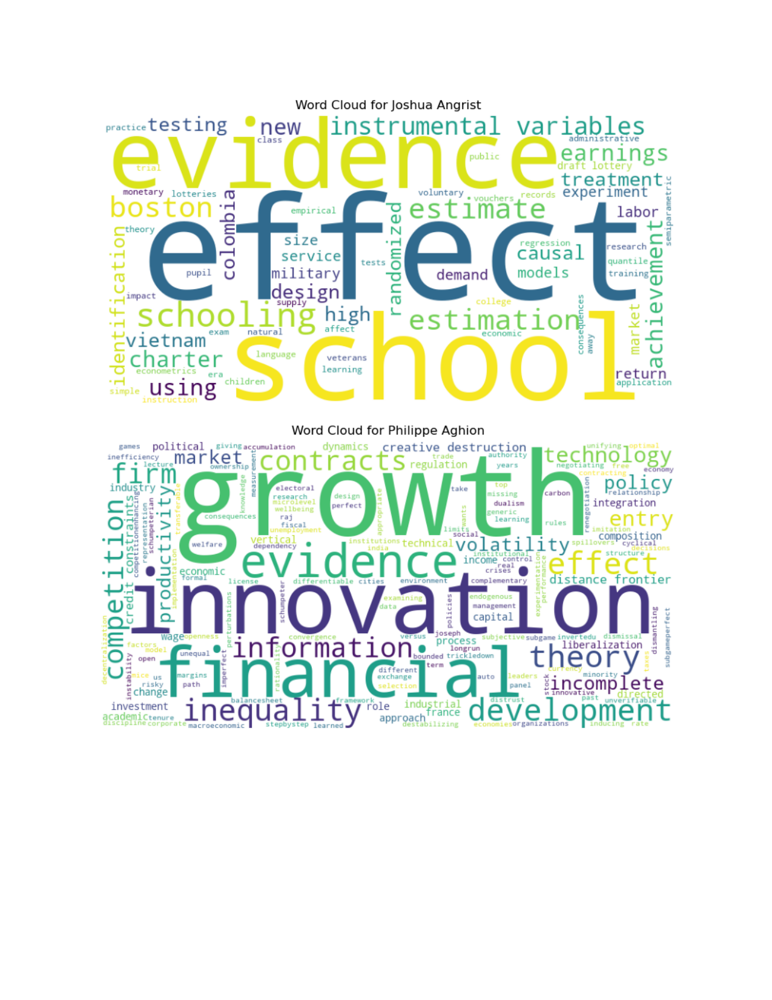
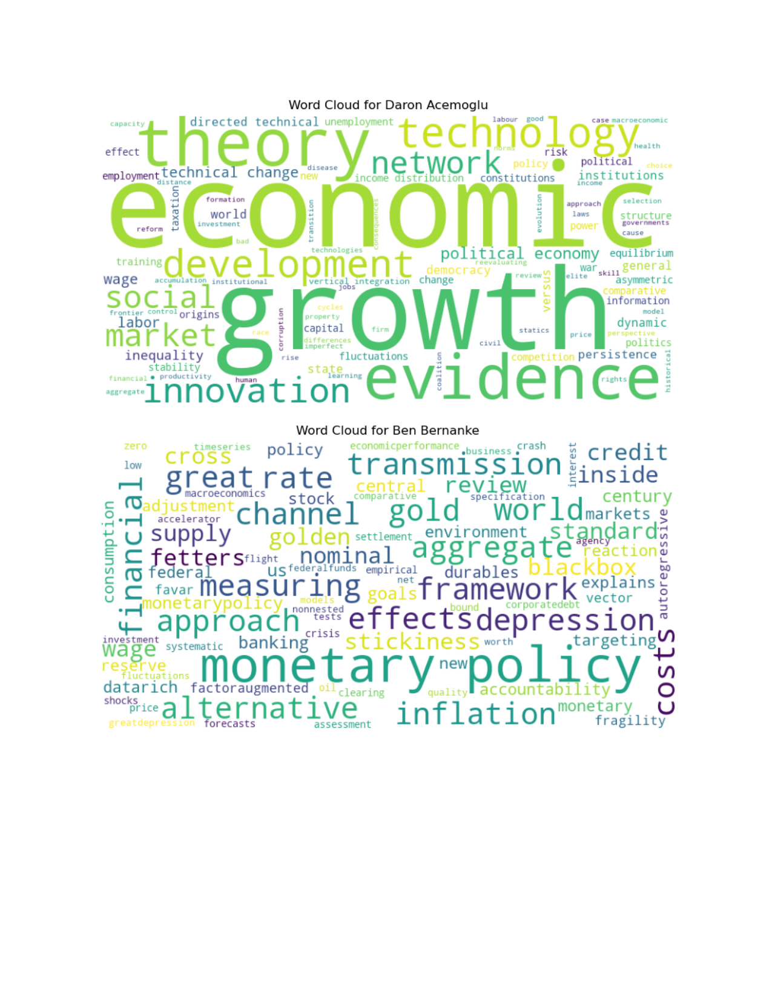
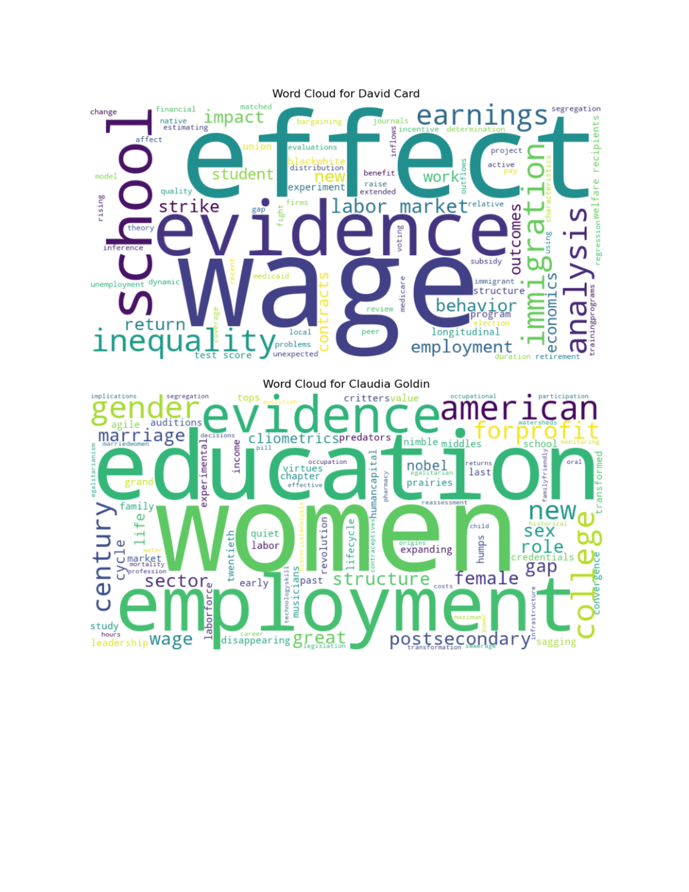
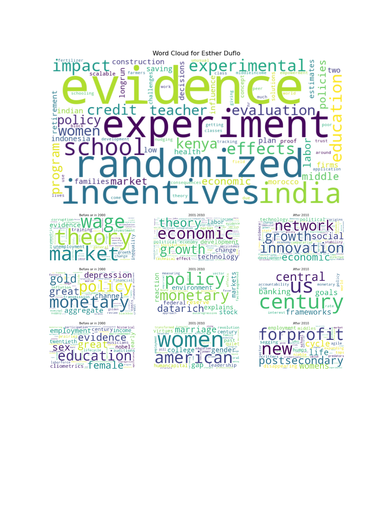
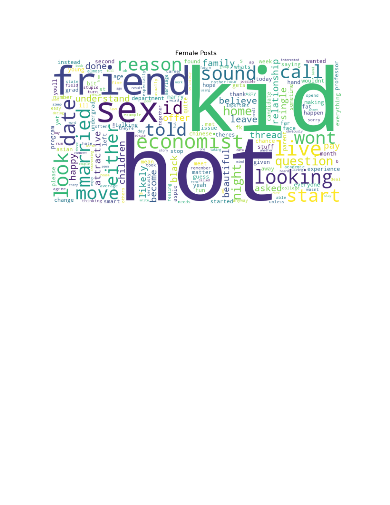
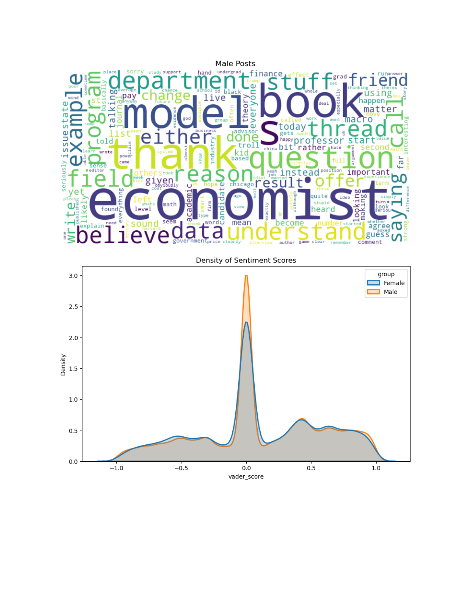

# Text Analysis in Economics Academia

Computational text analysis applied to two datasets in economics: (1) publication titles of recent Nobel laureates in economics, to surface research themes and track focus shifts over time; (2) posts from EconJobRumors (EJR), to examine whether anonymous online discussions among economists differ in language and sentiment when discussing women versus men.

## Background

Originally completed as a take-home assignment in ECO225 (Big-Data Tools for Economists, University of Toronto, Fall 2025).

---

## Part 1: Nobel Laureates in Economics

### Data
Publication title data for 7 recent Nobel laureates: Joshua Angrist, Philippe Aghion, Daron Acemoglu, Ben Bernanke, David Card, Claudia Goldin, Esther Duflo.

### Methods
Text cleaning (lowercasing, punctuation/digit removal, stopword filtering), per-laureate word cloud generation, and time-period segmented word clouds (pre-2000, 2001–2010, post-2010) for selected authors.

### Selected Findings
The dominant terms per laureate align tightly with their Nobel citations:
- **Angrist** — "school," "effect," "evidence" → causal inference in education
- **Aghion** — "growth," "innovation," "creative destruction" → endogenous growth theory
- **Acemoglu** — "institutions," "political," "democracy" → institutional economics
- **Bernanke** — "monetary," "policy," "depression" → Great Depression and monetary policy
- **Card** — "wage," "immigration," "labor market" → labor economics
- **Goldin** — "women," "education," "employment" → economics of gender
- **Duflo** — "experiment," "randomized," "evidence" → development RCTs

Time-period clouds revealed shifts in research focus — most notably for Acemoglu, who moved from theoretical/market topics pre-2010 toward growth, technology, and innovation networks post-2010.

---

## Part 2: Gender Stereotypes in Economics Academia (EconJobRumors)

### Data
EJR post dataset, plus female and male word classifier lists (57 female classifiers, 236 male classifiers).

### Methods
- Text cleaning of raw posts (lowercase, punctuation/digit removal, tokenization)
- Classifier-based filtering: extracted 87,605 posts referring exclusively to women and 303,450 referring exclusively to men
- Frequency analysis of the top 50 and top 200 most common words per gendered post group, with stopword and gender-classifier removal
- Refined word clouds after removing words common to both lists, plus the additional stopwords specified in the assignment
- VADER compound sentiment scoring on full raw posts, visualized as KDE density plots by gender group

### Findings
**Frequency analysis** revealed striking content differences:
- Posts about **men** were dominated by professional vocabulary: "economics," "paper," "research," "phd," "school," "market"
- Posts about **women** were dominated by personal/appearance vocabulary: "hot," "love," "kid," "date," "married," "looking"

**Sentiment analysis** showed that posts about women had a slightly more negative compound score distribution than posts about men. Posts about men had a higher density spike at neutral (0), reflecting greater use of vocabulary not in the VADER lexicon (technical/academic terminology).

### Conclusion
Even in an anonymous setting, economists' discussions about women in the field skew toward personal life and appearance, while discussions about men skew toward professional achievement and academic substance — a pattern consistent with broader literature on gender bias in academic environments.

---

## Tools

Python (Pandas, NLTK, VADER SentimentIntensityAnalyzer, WordCloud, Matplotlib, Seaborn, Counter)

## Files
- `text_analysis.py` — main analysis script with inline outputs and commentary
- `plots/` — output visualizations
